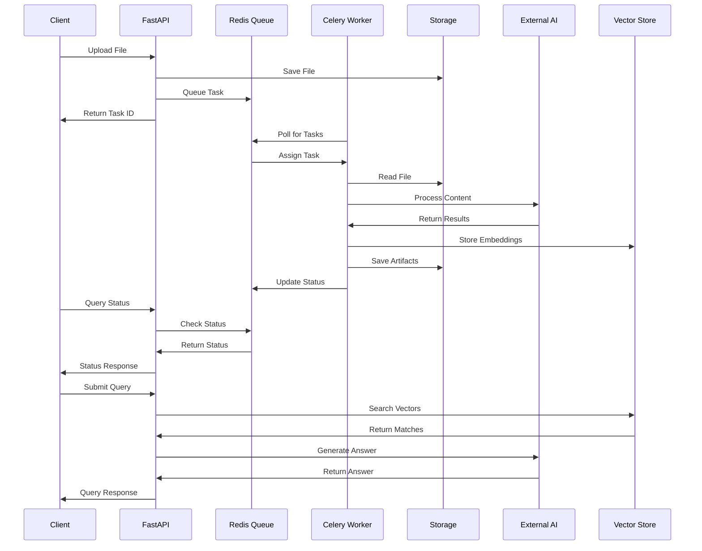

# Design Specification - Adhi Multimodal RAG System

## 1. System Architecture Design

### 1.1 High-Level Architecture

```
┌─────────────────────────────────────────────────────────────────────────────┐
│                              Client Layer                                   │
├─────────────────┬─────────────────┬─────────────────┬─────────────────────┤
│   Web Client    │  Streamlit UI   │   Mobile App    │    API Clients      │
│  (React/Next)   │   (Python)      │   (Future)      │   (Third-party)     │
└─────────┬───────┴─────────┬───────┴─────────────────┴─────────────────────┘
          │                 │
          └─────────────────┼─────────────────────────────────────────────────┐
                            │                                                 │
┌───────────────────────────▼─────────────────────────────────────────────────┤
│                        API Gateway Layer                                    │
├─────────────────────────────────────────────────────────────────────────────┤
│                      FastAPI Application                                    │
│  ┌─────────────┐ ┌─────────────┐ ┌─────────────┐ ┌─────────────────────┐   │
│  │   Ingestion │ │    Query    │ │    Task     │ │   Organization      │   │
│  │   Routes    │ │   Routes    │ │   Routes    │ │     Management      │   │
│  └─────────────┘ └─────────────┘ └─────────────┘ └─────────────────────┘   │
└─────────────────────────┬───────────────────────────────────────────────────┘
                          │
┌─────────────────────────▼───────────────────────────────────────────────────┐
│                    Message Queue Layer                                      │
├─────────────────────────────────────────────────────────────────────────────┤
│                         Redis Cluster                                       │
│  ┌─────────────┐ ┌─────────────┐ ┌─────────────┐ ┌─────────────────────┐   │
│  │   Task      │ │   Result    │ │   Session   │ │      Cache          │   │
│  │   Queue     │ │   Store     │ │   Store     │ │      Layer          │   │
│  └─────────────┘ └─────────────┘ └─────────────┘ └─────────────────────┘   │
└─────────────────────────┬───────────────────────────────────────────────────┘
                          │
┌─────────────────────────▼───────────────────────────────────────────────────┐
│                    Processing Layer                                         │
├─────────────────────────────────────────────────────────────────────────────┤
│  ┌─────────────────────┐              ┌─────────────────────────────────┐   │
│  │    CPU Workers      │              │         GPU Workers             │   │
│  │                     │              │                                 │   │
│  │  ┌───────────────┐  │              │  ┌─────────────────────────────┐ │   │
│  │  │ Audio Proc.   │  │              │  │    Video Processing         │ │   │
│  │  │ PDF Proc.     │  │              │  │    Image Analysis           │ │   │
│  │  │ Text Proc.    │  │              │  │    Frame Extraction         │ │   │
│  │  └───────────────┘  │              │  └─────────────────────────────┘ │   │
│  └─────────────────────┘              └─────────────────────────────────┘   │
└─────────────────────────┬───────────────────────────────────────────────────┘
                          │
┌─────────────────────────▼───────────────────────────────────────────────────┐
│                     Storage Layer                                           │
├─────────────────────────────────────────────────────────────────────────────┤
│  ┌─────────────┐ ┌─────────────┐ ┌─────────────┐ ┌─────────────────────┐   │
│  │   File      │ │  Metadata   │ │   Vector    │ │      Cache          │   │
│  │  Storage    │ │  Database   │ │   Store     │ │     Storage         │   │
│  │ (S3/Local)  │ │(PostgreSQL) │ │   (FAISS)   │ │     (Redis)         │   │
│  └─────────────┘ └─────────────┘ └─────────────┘ └─────────────────────┘   │
└─────────────────────────────────────────────────────────────────────────────┘
```

### 1.2 Component Interaction Flow



## 2. Data Architecture Design

### 2.1 Database Schema

```sql
-- Organizations table for multi-tenancy
CREATE TABLE organizations (
    id UUID PRIMARY KEY DEFAULT gen_random_uuid(),
    name VARCHAR(255) NOT NULL,
    slug VARCHAR(100) UNIQUE NOT NULL,
    settings JSONB DEFAULT '{}',
    created_at TIMESTAMP DEFAULT NOW(),
    updated_at TIMESTAMP DEFAULT NOW()
);

-- Sources table for tracking uploaded files
CREATE TABLE sources (
    id UUID PRIMARY KEY DEFAULT gen_random_uuid(),
    organization_id UUID REFERENCES organizations(id),
    source_id VARCHAR(255) NOT NULL,
    original_filename VARCHAR(500) NOT NULL,
    file_path VARCHAR(1000) NOT NULL,
    file_size BIGINT NOT NULL,
    content_type VARCHAR(100) NOT NULL,
    doc_type VARCHAR(50) NOT NULL, -- video, audio, image, pdf
    metadata JSONB DEFAULT '{}',
    processing_status VARCHAR(50) DEFAULT 'pending',
    created_at TIMESTAMP DEFAULT NOW(),
    updated_at TIMESTAMP DEFAULT NOW(),
    UNIQUE(organization_id, source_id)
);

-- Chunks table for storing processed content segments
CREATE TABLE chunks (
    id UUID PRIMARY KEY DEFAULT gen_random_uuid(),
    source_id UUID REFERENCES sources(id),
    chunk_index INTEGER NOT NULL,
    chunk_text TEXT NOT NULL,
    chunk_type VARCHAR(50) DEFAULT 'text', -- text, image, table
    start_time FLOAT, -- for audio/video
    end_time FLOAT,   -- for audio/video
    page_number INTEGER, -- for PDFs
    metadata JSONB DEFAULT '{}',
    embedding_vector VECTOR(384), -- for pgvector
    created_at TIMESTAMP DEFAULT NOW(),
    INDEX(source_id, chunk_index)
);

-- Artifacts table for storing processing outputs
CREATE TABLE artifacts (
    id UUID PRIMARY KEY DEFAULT gen_random_uuid(),
    source_id UUID REFERENCES sources(id),
    artifact_type VARCHAR(100) NOT NULL, -- transcript, frame, thumbnail
    file_path VARCHAR(1000) NOT NULL,
    metadata JSONB DEFAULT '{}',
    created_at TIMESTAMP DEFAULT NOW()
);

-- Queries table for tracking user queries
CREATE TABLE queries (
    id UUID PRIMARY KEY DEFAULT gen_random_uuid(),
    organization_id UUID REFERENCES organizations(id),
    query_text TEXT NOT NULL,
    response_text TEXT,
    source_chunks JSONB DEFAULT '[]',
    processing_time_ms INTEGER,
    created_at TIMESTAMP DEFAULT NOW()
);

-- Tasks table for Celery task tracking
CREATE TABLE tasks (
    id VARCHAR(255) PRIMARY KEY,
    source_id UUID REFERENCES sources(id),
    task_type VARCHAR(100) NOT NULL,
    status VARCHAR(50) NOT NULL,
    progress_percent FLOAT DEFAULT 0.0,
    details TEXT,
    error_message TEXT,
    created_at TIMESTAMP DEFAULT NOW(),
    updated_at TIMESTAMP DEFAULT NOW()
);
```

### 2.2 File Storage Structure

```
data/
├── uploads/                    # Original uploaded files
│   ├── {org_id}/
│   │   ├── {source_id}.mp4
│   │   ├── {source_id}.pdf
│   │   └── ...
├── transcripts/               # Generated transcripts
│   ├── {org_id}/
│   │   ├── {source_id}/
│   │   │   ├── transcript.json
│   │   │   └── segments.json
├── frames/                    # Extracted video frames
│   ├── {org_id}/
│   │   ├── {source_id}/
│   │   │   ├── frame_001.jpg
│   │   │   ├── frame_002.jpg
│   │   │   └── ...
├── images/                    # Processed images and PDF pages
│   ├── {org_id}/
│   │   ├── {source_id}/
│   │   │   ├── page_001.jpg
│   │   │   ├── page_002.jpg
│   │   │   └── ...
└── vectors/                   # Vector index files
    ├── {org_id}/
    │   ├── faiss.index
    │   ├── metadata.json
    └── ...
```

## 3. API Design

### 3.1 REST API Endpoints

```yaml
openapi: 3.0.0
info:
  title: Adhi Multimodal RAG API
  version: 1.0.0
  description: API for multimodal content ingestion and querying

paths:
  /api/v1/ingest:
    post:
      summary: Ingest multimedia file
      requestBody:
        content:
          multipart/form-data:
            schema:
              type: object
              properties:
                file:
                  type: string
                  format: binary
                type:
                  type: string
                  enum: [video, audio, image, pdf]
                source_id:
                  type: string
                organization_id:
                  type: string
                metadata:
                  type: string
                  description: JSON string
      responses:
        202:
          description: File accepted for processing
          content:
            application/json:
              schema:
                type: object
                properties:
                  task_id:
                    type: string
                  status_url:
                    type: string

  /api/v1/status/{task_id}:
    get:
      summary: Get task status
      parameters:
        - name: task_id
          in: path
          required: true
          schema:
            type: string
      responses:
        200:
          description: Task status
          content:
            application/json:
              schema:
                type: object
                properties:
                  task_id:
                    type: string
                  status:
                    type: string
                    enum: [PENDING, PROCESSING, SUCCESS, FAILURE]
                  progress_percent:
                    type: number
                  details:
                    type: string
                  artifacts:
                    type: object

  /api/v1/query:
    post:
      summary: Query processed content
      requestBody:
        content:
          application/json:
            schema:
              type: object
              properties:
                query:
                  type: string
                organization_id:
                  type: string
                top_k:
                  type: integer
                  default: 5
                filters:
                  type: object
      responses:
        200:
          description: Query response
          content:
            application/json:
              schema:
                type: object
                properties:
                  answer:
                    type: string
                  sources:
                    type: array
                    items:
                      type: object
                  query_id:
                    type: string
```

### 3.2 WebSocket API Design

```javascript
// Real-time task status updates
const ws = new WebSocket('ws://localhost:8000/ws/tasks/{task_id}');

ws.onmessage = function(event) {
    const update = JSON.parse(event.data);
    // {
    //   "task_id": "abc123",
    //   "status": "PROCESSING",
    //   "progress_percent": 45.0,
    //   "details": "Extracting audio from video..."
    // }
};
```

## 4. Processing Pipeline Design

### 4.1 Video Processing Pipeline

```python
class VideoProcessingPipeline:
    def __init__(self, task_self, source_id, file_path, organization_id):
        self.task_self = task_self
        self.source_id = source_id
        self.file_path = Path(file_path)
        self.organization_id = organization_id
        
    async def process(self):
        # Step 1: Extract audio (10% progress)
        audio_path = await self.extract_audio()
        self.update_progress(10, "Audio extracted")
        
        # Step 2: Transcribe audio (50% progress)
        transcript = await self.transcribe_audio(audio_path)
        self.update_progress(50, "Audio transcribed")
        
        # Step 3: Extract frames (70% progress)
        frames = await self.extract_frames()
        self.update_progress(70, "Frames extracted")
        
        # Step 4: Analyze frames (85% progress)
        frame_analysis = await self.analyze_frames(frames)
        self.update_progress(85, "Frames analyzed")
        
        # Step 5: Create embeddings (95% progress)
        embeddings = await self.create_embeddings(transcript, frame_analysis)
        self.update_progress(95, "Embeddings created")
        
        # Step 6: Store results (100% progress)
        artifacts = await self.store_results(transcript, frames, embeddings)
        self.update_progress(100, "Processing complete")
        
        return artifacts
```

### 4.2 Audio Processing Pipeline

```python
class AudioProcessingPipeline:
    def __init__(self, task_self, source_id, file_path, organization_id, language="en"):
        self.task_self = task_self
        self.source_id = source_id
        self.file_path = Path(file_path)
        self.organization_id = organization_id
        self.language = language
        
    async def process(self):
        # Step 1: Validate audio format (5% progress)
        await self.validate_audio()
        self.update_progress(5, "Audio validated")
        
        # Step 2: Convert to supported format if needed (15% progress)
        processed_audio = await self.convert_audio()
        self.update_progress(15, "Audio converted")
        
        # Step 3: Transcribe using Sarvam AI (70% progress)
        transcript = await self.transcribe_with_sarvam(processed_audio)
        self.update_progress(70, "Transcription complete")
        
        # Step 4: Process transcript segments (85% progress)
        segments = await self.process_segments(transcript)
        self.update_progress(85, "Segments processed")
        
        # Step 5: Create embeddings (95% progress)
        embeddings = await self.create_embeddings(segments)
        self.update_progress(95, "Embeddings created")
        
        # Step 6: Store results (100% progress)
        artifacts = await self.store_results(transcript, segments, embeddings)
        self.update_progress(100, "Processing complete")
        
        return artifacts
```

### 4.3 PDF Processing Pipeline

```python
class PDFProcessingPipeline:
    def __init__(self, task_self, source_id, file_path, organization_id):
        self.task_self = task_self
        self.source_id = source_id
        self.file_path = Path(file_path)
        self.organization_id = organization_id
        
    async def process(self):
        # Step 1: Extract text content (20% progress)
        text_content = await self.extract_text()
        self.update_progress(20, "Text extracted")
        
        # Step 2: Convert pages to images (40% progress)
        page_images = await self.convert_to_images()
        self.update_progress(40, "Pages converted to images")
        
        # Step 3: OCR on images (60% progress)
        ocr_results = await self.perform_ocr(page_images)
        self.update_progress(60, "OCR completed")
        
        # Step 4: Detect tables and figures (75% progress)
        structured_content = await self.detect_structures(page_images)
        self.update_progress(75, "Structures detected")
        
        # Step 5: Merge and chunk content (90% progress)
        chunks = await self.create_chunks(text_content, ocr_results, structured_content)
        self.update_progress(90, "Content chunked")
        
        # Step 6: Create embeddings and store (100% progress)
        artifacts = await self.create_and_store_embeddings(chunks, page_images)
        self.update_progress(100, "Processing complete")
        
        return artifacts
```

## 5. Query Processing Design

### 5.1 Query Pipeline Architecture

```python
class QueryProcessor:
    def __init__(self, retriever, reranker, answer_generator):
        self.retriever = retriever
        self.reranker = reranker
        self.answer_generator = answer_generator
        
    async def process_query(self, query_request):
        # Step 1: Query understanding and expansion
        processed_query = await self.preprocess_query(query_request.query)
        
        # Step 2: Vector retrieval
        initial_results = await self.retriever.retrieve(
            processed_query, 
            top_k=query_request.top_k * 2,  # Retrieve more for reranking
            filters=query_request.filters
        )
        
        # Step 3: Reranking (optional)
        if self.reranker:
            reranked_results = await self.reranker.rerank(
                processed_query, 
                initial_results
            )
        else:
            reranked_results = initial_results[:query_request.top_k]
        
        # Step 4: Answer generation
        answer = await self.answer_generator.generate(
            query_request.query,
            reranked_results
        )
        
        # Step 5: Response formatting
        return self.format_response(answer, reranked_results)
```

### 5.2 Vector Retrieval Design

```python
class VectorRetriever:
    def __init__(self, embedding_model, vector_store):
        self.embedding_model = embedding_model
        self.vector_store = vector_store
        
    async def retrieve(self, query, top_k=5, filters=None):
        # Generate query embedding
        query_embedding = await self.embedding_model.encode(query)
        
        # Apply filters
        search_filters = self.build_filters(filters)
        
        # Search vector store
        results = await self.vector_store.search(
            query_embedding,
            top_k=top_k,
            filters=search_filters
        )
        
        # Enrich with metadata
        enriched_results = await self.enrich_results(results)
        
        return enriched_results
        
    def build_filters(self, filters):
        """Convert API filters to vector store filters"""
        if not filters:
            return {}
            
        search_filters = {}
        
        if filters.organization_id:
            search_filters['organization_id'] = filters.organization_id
            
        if filters.doc_type:
            search_filters['doc_type'] = filters.doc_type.value
            
        if filters.source_id:
            search_filters['source_id'] = filters.source_id
            
        if filters.date_from or filters.date_to:
            search_filters['date_range'] = {
                'from': filters.date_from,
                'to': filters.date_to
            }
            
        return search_filters
```

## 6. Security Design

### 6.1 Authentication & Authorization

```python
class SecurityManager:
    def __init__(self):
        self.api_key_store = APIKeyStore()
        self.session_manager = SessionManager()
        
    async def authenticate_request(self, request):
        # Check for API key in header
        api_key = request.headers.get('X-API-Key')
        if api_key:
            return await self.validate_api_key(api_key)
            
        # Check for session token
        session_token = request.headers.get('Authorization')
        if session_token:
            return await self.validate_session(session_token)
            
        raise AuthenticationError("No valid authentication provided")
        
    async def authorize_organization_access(self, user, organization_id):
        """Ensure user has access to the specified organization"""
        user_orgs = await self.get_user_organizations(user)
        if organization_id not in user_orgs:
            raise AuthorizationError("Access denied to organization")
```

### 6.2 Data Encryption

```python
class EncryptionManager:
    def __init__(self, encryption_key):
        self.cipher = Fernet(encryption_key)
        
    def encrypt_sensitive_data(self, data):
        """Encrypt PII and sensitive content"""
        if self.contains_pii(data):
            return self.cipher.encrypt(data.encode())
        return data
        
    def decrypt_data(self, encrypted_data):
        """Decrypt data for authorized access"""
        return self.cipher.decrypt(encrypted_data).decode()
        
    def contains_pii(self, text):
        """Detect potential PII in text content"""
        # Implementation for PII detection
        pii_patterns = [
            r'\b\d{3}-\d{2}-\d{4}\b',  # SSN
            r'\b\d{4}[-\s]?\d{4}[-\s]?\d{4}[-\s]?\d{4}\b',  # Credit card
            r'\b[A-Za-z0-9._%+-]+@[A-Za-z0-9.-]+\.[A-Z|a-z]{2,}\b'  # Email
        ]
        
        for pattern in pii_patterns:
            if re.search(pattern, text):
                return True
        return False
```

## 7. Performance Optimization Design

### 7.1 Caching Strategy

```python
class CacheManager:
    def __init__(self, redis_client):
        self.redis = redis_client
        self.cache_ttl = {
            'query_results': 3600,      # 1 hour
            'embeddings': 86400,        # 24 hours
            'file_metadata': 7200,      # 2 hours
            'transcripts': 43200        # 12 hours
        }
        
    async def get_cached_query(self, query_hash, organization_id):
        """Get cached query results"""
        cache_key = f"query:{organization_id}:{query_hash}"
        cached_result = await self.redis.get(cache_key)
        
        if cached_result:
            return json.loads(cached_result)
        return None
        
    async def cache_query_result(self, query_hash, organization_id, result):
        """Cache query results"""
        cache_key = f"query:{organization_id}:{query_hash}"
        await self.redis.setex(
            cache_key,
            self.cache_ttl['query_results'],
            json.dumps(result)
        )
```

### 7.2 Database Optimization

```sql
-- Indexes for performance optimization
CREATE INDEX idx_sources_org_type ON sources(organization_id, doc_type);
CREATE INDEX idx_sources_status ON sources(processing_status);
CREATE INDEX idx_chunks_source ON chunks(source_id);
CREATE INDEX idx_chunks_embedding ON chunks USING ivfflat (embedding_vector vector_cosine_ops);
CREATE INDEX idx_queries_org_time ON queries(organization_id, created_at DESC);
CREATE INDEX idx_tasks_status ON tasks(status, created_at);

-- Partitioning for large tables
CREATE TABLE chunks_partitioned (
    LIKE chunks INCLUDING ALL
) PARTITION BY HASH (organization_id);

CREATE TABLE chunks_part_0 PARTITION OF chunks_partitioned
    FOR VALUES WITH (MODULUS 4, REMAINDER 0);
CREATE TABLE chunks_part_1 PARTITION OF chunks_partitioned
    FOR VALUES WITH (MODULUS 4, REMAINDER 1);
-- ... additional partitions
```

## 8. Monitoring and Observability Design

### 8.1 Metrics Collection

```python
class MetricsCollector:
    def __init__(self):
        self.metrics = {
            'api_requests': Counter('api_requests_total'),
            'processing_time': Histogram('processing_time_seconds'),
            'queue_size': Gauge('queue_size'),
            'active_workers': Gauge('active_workers'),
            'error_rate': Counter('errors_total')
        }
        
    def record_api_request(self, endpoint, method, status_code):
        self.metrics['api_requests'].labels(
            endpoint=endpoint,
            method=method,
            status=status_code
        ).inc()
        
    def record_processing_time(self, task_type, duration):
        self.metrics['processing_time'].labels(
            task_type=task_type
        ).observe(duration)
```

### 8.2 Health Check Design

```python
class HealthChecker:
    def __init__(self, dependencies):
        self.dependencies = dependencies
        
    async def check_health(self):
        health_status = {
            'status': 'healthy',
            'timestamp': datetime.utcnow().isoformat(),
            'checks': {}
        }
        
        # Check database connectivity
        try:
            await self.dependencies['database'].execute('SELECT 1')
            health_status['checks']['database'] = 'healthy'
        except Exception as e:
            health_status['checks']['database'] = f'unhealthy: {str(e)}'
            health_status['status'] = 'unhealthy'
            
        # Check Redis connectivity
        try:
            await self.dependencies['redis'].ping()
            health_status['checks']['redis'] = 'healthy'
        except Exception as e:
            health_status['checks']['redis'] = f'unhealthy: {str(e)}'
            health_status['status'] = 'unhealthy'
            
        # Check external API availability
        for service_name, service_client in self.dependencies['external_apis'].items():
            try:
                await service_client.health_check()
                health_status['checks'][service_name] = 'healthy'
            except Exception as e:
                health_status['checks'][service_name] = f'unhealthy: {str(e)}'
                # External API failures don't mark system as unhealthy
                
        return health_status
```

## 9. Deployment Design

### 9.1 Container Architecture

```dockerfile
# Multi-stage build for optimization
FROM python:3.11-slim as base
WORKDIR /app
COPY requirements.txt .
RUN pip install --no-cache-dir -r requirements.txt

FROM base as api
COPY app/ ./app/
EXPOSE 8000
CMD ["uvicorn", "app.main:app", "--host", "0.0.0.0", "--port", "8000"]

FROM base as worker
COPY app/ ./app/
CMD ["celery", "-A", "app.workers.celery_app", "worker", "--loglevel=info"]
```

### 9.2 Kubernetes Deployment

```yaml
apiVersion: apps/v1
kind: Deployment
metadata:
  name: adhi-api
spec:
  replicas: 3
  selector:
    matchLabels:
      app: adhi-api
  template:
    metadata:
      labels:
        app: adhi-api
    spec:
      containers:
      - name: api
        image: adhi:latest
        ports:
        - containerPort: 8000
        env:
        - name: DATABASE_URL
          valueFrom:
            secretKeyRef:
              name: adhi-secrets
              key: database-url
        resources:
          requests:
            memory: "512Mi"
            cpu: "250m"
          limits:
            memory: "1Gi"
            cpu: "500m"
---
apiVersion: apps/v1
kind: Deployment
metadata:
  name: adhi-workers
spec:
  replicas: 2
  selector:
    matchLabels:
      app: adhi-workers
  template:
    metadata:
      labels:
        app: adhi-workers
    spec:
      containers:
      - name: worker
        image: adhi-worker:latest
        env:
        - name: CELERY_BROKER_URL
          valueFrom:
            secretKeyRef:
              name: adhi-secrets
              key: redis-url
        resources:
          requests:
            memory: "1Gi"
            cpu: "500m"
          limits:
            memory: "2Gi"
            cpu: "1000m"
```

This comprehensive design specification provides the technical blueprint for implementing the Adhi Multimodal RAG system with proper architecture, security, performance, and deployment considerations.